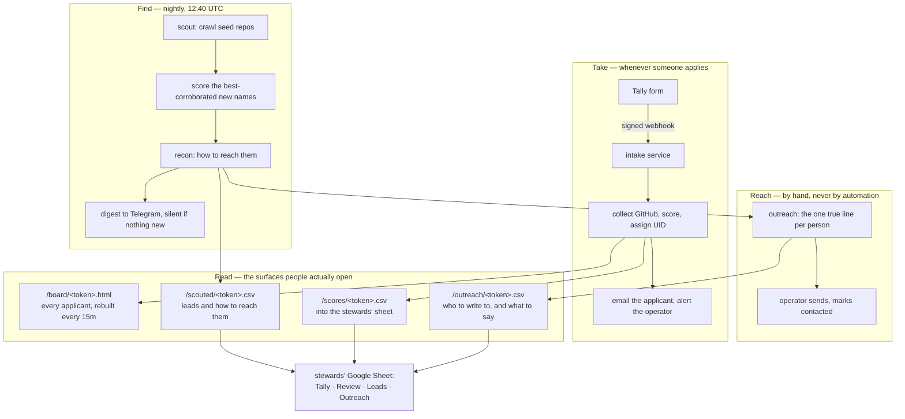

# The pipeline, end to end

The Python package is the scorer. It is not the system. The system is a loop
that runs whether or not anyone is watching it: it finds people, scores them,
tells an operator, takes applications, and puts all of it in front of the
stewards who decide. Most of that loop lives outside the package -- in cron, in
a tunnel, in a spreadsheet inside somebody else's Google workspace -- and until
this document existed it lived only in the head of whoever built it and on the
one box that ran it.



## What runs, and when

| Piece | Where | Trigger | If it stops |
|---|---|---|---|
| Intake service | `talent_engine.cli serve`, `talent-engine-intake.service` | always on, `127.0.0.1:8787` | applications are accepted by Tally and never scored; nothing retries a Tally webhook |
| Public ingress | `cloudflared-sponsorships.service` | always on | the form page and all three feeds 404 at the edge |
| Nightly scout + recon | `deploy/daily-scout.sh` | cron 12:40 UTC | no new names; the digest simply never arrives, which looks identical to a quiet night |
| Board rebuild + stuck alert | `deploy/applicant-watch.sh` | cron every 15 min | the board freezes at its last good copy while still answering 200 |
| Ledger backup | `deploy/backup-talent-engine.sh` | cron 03:25 UTC | the audit log, contacts and decisions exist in one place only |

## The six contracts

These are the promises other things are built on. Each one has a test, because
each one was learned by breaking it.

**1. A feed's join key is its first column.** `VLOOKUP` matches on the first
column of its range and nothing else. Putting the applicant reference in front
of the submission id silently broke every lookup in the stewards' sheet -- the
formula went hunting for a submission id in a column of references and matched
nothing, and the sheet reported no error, just blanks. Column order in someone's
spreadsheet is their business; the join key stays first in ours.

**2. The scouted feed is append-only.** Rows come out oldest-first by discovery,
ties broken by handle. The outreach tab is typed by hand beside it and holds its
alignment by row number, so a row that moved would slide every note onto the
wrong person. A new candidate can only ever appear at the bottom.

**3. Contact details are absent from shared surfaces, not filtered out of them.**
The scores feed module never opens the `contacts` table. The served board is
generated without `--contacts`. The terms applicants accepted say contact details
never appear in a score, snapshot, dossier or public artefact, and the strongest
way to keep that true is for the data not to be in the process at all.

**4. The token in the path is the access control.** A spreadsheet pulls these
anonymously; there is no session to authenticate. So each feed carries its own
random path segment, each is a separate token so revoking one does not take the
others down, and an unset token means the route does not exist at all -- the
handler never registers a path it has no token for, which fails closed.

**5. A reference, once issued, is permanent.** `PRE-S3-S-007` is what a steward
says out loud in a meeting. Numbers come from a high-water-mark counter, not
from `MAX(seq)+1`, so deleting a row cannot cause the next applicant to be
issued a reference that has already gone out.

**6. Nothing writes to a stranger.** The programme's terms say people found by
scouting "are contacted only to invite an application", and there is no X
credential on this host so that the sentence stays true by construction rather
than by discipline. `tools/outreach.py` builds the list and drafts the message;
a person sends it. The list excludes anyone who has already applied and anyone
already marked contacted, and `outreach_hooks.sent_at` survives every rebuild --
the hook is derived data and can be recomputed, the fact that a human already
wrote to somebody cannot. A row with no verifiable hook renders an empty message
rather than a vague one. See [OUTREACH.md](OUTREACH.md).

## The stewards' sheet

Five tabs. The first is Tally's own; the rest are ours.

| Tab | What it is |
|---|---|
| Tally | where the form writes. Contact details live here, inside the workspace, and nowhere else that is shared |
| Review | `=IMPORTDATA(".../scores/<token>.csv")` — scores beside the applications |
| Leads | `=IMPORTDATA(".../scouted/<token>.csv")` — who the scout found and how to reach them |
| Outreach | typed by hand, identity columns pulled from Leads |
| Send | `=IMPORTDATA(".../outreach/<token>.csv")` — reachable candidates, best-scored first, with the line that says how each was found. Re-sorts and shrinks, so never type beside it: `tools/outreach.py --mark` is where "contacted" lives |

Outreach, in `A2`, `B2`, `C2`:

```
=ARRAYFORMULA(IF(Leads!A2:A="","",Leads!A2:A))    handle
=ARRAYFORMULA(IF(Leads!A2:A="","",Leads!B2:B))    X
=ARRAYFORMULA(IF(Leads!A2:A="","",Leads!F2:F))    score
```

Then type freely from `D` on: reached out, date, channel, reply, notes.
**Never sort or filter that tab in place** -- the typed columns are held in
place by row number, so sorting slides notes onto the wrong people. Use a filter
view, which changes what you see without moving anything.

## What reaching people actually looks like

Recon reads only what a person published on their own GitHub profile, in
descending order of how much the source can be trusted: the twitter field, then
linked social accounts, then links in the website and bio, then the profile
README. Every answer records which source it came from, because a README link is
a much weaker claim than a profile field and somebody about to spend an outreach
message deserves to know which one they are trusting.

It does not guess handles from names and does not follow links off GitHub. Both
would raise the hit rate and both would produce confident wrong answers.

The honest numbers, at 90 scored leads: 15 have an X account, 15 publish an
email, 32 are reachable through any channel at all. Two thirds of the developers
this pipeline finds publish no way to contact them. That is the population, not
a defect in the tooling, and any plan built on this list should assume a third.

## Rebuilding it

```
git clone <repo> && cd talent-engine
cp deploy/intake.env.example ~/talent-engine-runtime/intake.env   # then fill it in
chmod 600 ~/talent-engine-runtime/intake.env
bash deploy/install.sh          # --dry-run first if you like
```

`install.sh` links the cron scripts back into the repo, checks the credential
file for missing keys, and prints the root-owned steps rather than performing
them. It creates no secrets: an installer that invents one leaves you unable to
tell a fresh install from a silently reset one.

## Footguns, all of them learned the hard way

- **cloudflared does not reload its ingress.** A new route answers 200 locally
  and 404 at the edge until `systemctl restart cloudflared-sponsorships`.
- **Cloudflare caches by extension.** It held a `404` on a `.csv` for four
  hours. Feeds send `Cache-Control: no-store`.
- **`SELECT datetime('now', '-N days')` returns `2026-08-20 05:16:00`;** stored
  timestamps are `2026-08-20T05:10:54+00:00`. Compared as strings, `T` sorts
  above the space, so a staleness filter inverts and silently skips everything
  it was meant to re-check -- while reporting success. Build cutoffs in Python.
- **A GitHub 409 on `/commits` means an empty repository, not an error.** On
  launch day it aborted two whole applications, and the only visible symptom was
  three emails where five were expected.
- **Anything cron regenerates must be served, not published.** A published
  snapshot cannot be refreshed by a scheduled job, so it goes stale silently
  while still looking authoritative.
